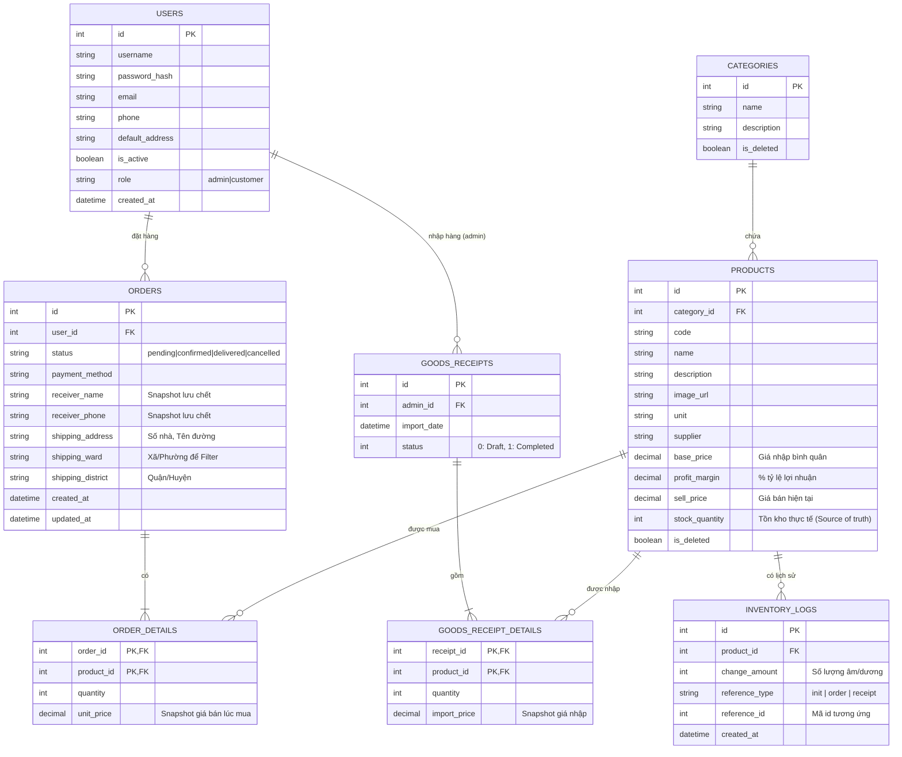

# Thiết Kế Chi Tiết Cơ Sở Dữ Liệu (Database Design & ERD)

Tài liệu này trình bày sơ đồ thực thể (ERD), phân loại tính chất các bảng dữ liệu, và mô tả chi tiết logic 2 bài toán lớn: **Reservation (Trừ tồn kho tạm) và Double Write**. Nhằm đáp ứng yêu cầu đồ án web tĩnh không quá phức tạp (over-engineering), kiến trúc vẫn đảm bảo chuẩn hóa nhưng sử dụng các đánh đổi (trade-offs) đã được thống nhất.

---

## 1. Sơ Đồ ERD (Entity-Relationship Diagram)



---

## 2. Phân Loại Bảng (Cực Kỳ Quan Trọng)

- **Source of Truth (Nguồn Sự Thật Duy Nhất):**
  - Cột `PRODUCTS.stock_quantity`. (Logic: Bán được hay không nhìn vào cột này, không mất thời gian JOIN/SUM log khi người dùng lướt web).
- **Snapshot (Bản Sao Không Thể Chỉnh Sửa Dùng 1 Lần):**
  - Cột `ORDER_DETAILS.unit_price`. (Lưu thẳng giá bán của `PRODUCTS` tại giây phút đặt hàng. Sản phẩm sau đó có tăng/giảm giá cũng kệ).
  - Cột `ORDERS.shipping_address`, `shipping_ward`, `receiver_name`. (Lấy thông tin `USERS` đắp vào hoặc sinh mới tạo thành Snapshot gửi cho shipper).
  - Cột `GOODS_RECEIPT_DETAILS.import_price`.
- **Log / Audit (Nhật Ký Truy Vết):**
  - Bảng `INVENTORY_LOGS`. Nó giống bảng sao kê tài khoản ngân hàng. Tiền thực trong kho (`stock_quantity`) luôn phải khớp với các lượt giao dịch trong sao kê.

---

## 3. Bắt Buộc Xử Lý: Reservation Logic (Trừ Tồn Kho Ở Pending)

Để tránh phức tạp hóa hệ thống, chúng ta **không tạo thêm** một cột như `reserved_quantity`, mà sử dụng luôn `stock_quantity` trừ trực tiếp để giữ chỗ.

### 3.1. Dữ Liệu Chảy Thế Nào Khi Bấm Đặt Hàng (Create Order)?
- **Flow chi tiết:**
  1. FE gửi Request (Array Sản Phẩm x Số lượng).
  2. SQL SELECT `stock_quantity` từ `PRODUCTS`.
  3. Nếu `stock_quantity` < `số lượng` mua $\to$ Báo lỗi Hết hàng, hủy ngay lập tức.
  4. Nếu đủ $\to$ SQL INSERT vào `ORDERS` (trạng thái `Pending`).
  5. SQL INSERT các dòng cho `ORDER_DETAILS`.
  6. **Ghi và Trừ Kho:** Vòng lặp các sản phẩm trong giỏ:
     - `UPDATE PRODUCTS SET stock_quantity = stock_quantity - {số lượng}` (Trừ đứt luôn).
     - `INSERT INTO INVENTORY_LOGS (product_id, change_amount, reference_type, reference_id) VALUES ({product_id}, -{số lượng}, 'order', {order_id})`

### 3.2. Dữ Liệu Hoàn Lại Thế Nào Khi Hủy Đơn (Cancel Order)?
- **Flow chi tiết:**
  1. Xảy ra khi Khách tự hủy Pending, hoặc Admin bấm hủy Đơn (Pending/Confirmed).
  2. Đọc ngược rổ hàng bằng câu SQL: `SELECT product_id, quantity FROM ORDER_DETAILS WHERE order_id = {X}`
  3. Vòng lặp các sản phẩm trong rổ hàng ở trên:
     - `UPDATE PRODUCTS SET stock_quantity = stock_quantity + {quantity}` (Trả lại kho vào cái giỏ sản phẩm đó).
     - `INSERT INTO INVENTORY_LOGS (product_id, change_amount, reference_type, reference_id) VALUES ({product_id}, +{quantity}, 'order', {order_id})` (Tạo dòng dấu cộng Audit).
  4. Đổi trạng thái `ORDERS.status = 'cancelled'`.

- **Chống sai số (Order Modified):** Vì nghiệp vụ hệ thống đồ án này Admin và Khách CHỈ đổi trạng thái trạng thái hóa đơn (1 Chiều) và KHÔNG ĐƯỢC PHÉP SỬA số lượng hàng trong `ORDER_DETAILS` sau khi đã đặt hàng. Nên số liệu lượng bù trừ lấy từ `ORDER_DETAILS` là **Snapshot Vĩnh viễn Bất biến**, hoàn toàn không bao giờ xáy ra chuyện bị hoàn sai số tồn kho do bill bị sửa đổi (Edited).

- **Rủi ro kẹt kho & Giải pháp (Mitigation):**
  - Trái Đắng: Trừ kho trực tiếp ngay lúc `Pending`. Khách đặt xong vứt đó, chây ỳ đi ngủ $\to$ Vài cái áo bị kìm kho không cho ai mua được.
  - Xử lý: Không chạy Cronjob (để tránh Over-Engineering Backend). Lùi 1 bước: Admin sẽ dùng UI "Quản lý Đơn Hàng", Filter các đơn `Pending` từ Hôm Qua. Admin mở đơn, bấm "Hủy Đơn" bằng cờ lê. Kho tự động trả lại hàng cho người chờ mua kế tiếp trong 1 nốt nhạc $\to$ Vấn đề kẹt kho được trị triệt để bằng thao tác tay định kỳ của Admin (Phù hợp logic đồ án).

---

## 4. Bắt Buộc Xử Lý: Double Write Problem (Lệch Dữ Liệu Tồn Kho)

Bản chất của việc vừa UPDATE trên `PRODUCTS` và vừa INSERT vào `INVENTORY_LOGS` là tạo ra 2 lần Ghi trên CSDL. Nếu lệnh UPDATE xong mà rớt mạng ko INSERT được Log $\to$ Source of truth chênh lệnh với Audit (Lệch kho). 

### 4.1. Giải Pháp Đồng Bộ: Lướt Trên Database Transaction Boundary
Bất cứ một Action nào nhắc tới "Xoay vòng Tồn kho" (Create Order, Cancel Order, Hoàn thành Phiếu Nhập) phải được bọc trong vạch Transaction tại tầng Backend:

```sql
BEGIN TRANSACTION; -- Kẹp lệnh bảo vệ
  -- 1. Xử lý ghi Hóa Đơn / Phiếu Nhập ...
  -- 2. UPDATE Products ...
  -- 3. INSERT Inventory_Logs ...
COMMIT; -- Chốt ván
```
Nếu 1 câu lệnh bỗng dưng báo lỗi (Tràn DB, Lỗi logic mã), Backend chủ động quăng Excepton $\to$ `ROLLBACK TRANSACTION;`.
**Kết quả:** Dữ liệu hoàn toàn quay lại lúc chưa bấm nút, không có bất kỳ rác sai tồn kho / mồ côi dư thừa nào được ghi ra đĩa. Không bao giờ Lệch Dữ liệu!

### 4.2. Debug & Tự Xử Mismatch Bằng Tool (Reconcile Tool)
- **Cơ sở dữ liệu Trace ngược:** Bảng `INVENTORY_LOGS` có lưu Cột `reference_type` (`'order'` hay `'receipt'`) và `reference_id` (là ID của Đơn Hàng hay Phiếu Nhập sinh ra nó). Admin xem Audit sẽ ngay lập tức đối chiếu: *"Chà, cái bút này tự dưng bị trừ 5 cái vào lúc 3 giờ do thằng Đơn Hàng Số #989 gây ra"*. Mọi thứ rõ như ban ngày.
- **Cách Detective Lệch/Mismatch:** 
  Viết 1 API nội bộ (chỉ Admin gọi): `SELECT SUM(change_amount) FROM INVENTORY_LOGS WHERE product_id = X;`. Lấy cái kết quả Tổng Phân Rã Logs đó đắp so sánh với `PRODUCTS.stock_quantity`. NẾU `SUM != stock_quantity` $\to$ Cảnh báo ĐỎ có sự cố lệch số dư nội tại.
- **Cách Chữa Cháy (Reconcile / Đồng bộ lại):**
  Vì bảng Lịch Sử (`INVENTORY_LOGS`) là nơi tin tưởng các luồng ra vào hơn cả Source of Truth khi xảy ra lỗi. Hệ thống chỉ cần đè lại tổng từ Logs xuống: 
  `UPDATE PRODUCTS SET stock_quantity = (SELECT SUM(change_amount) FROM INVENTORY_LOGS WHERE product_id = {X}) WHERE id = {X};`. Bù trừ sai lệnh thành công.

---

## 5. Tồn Kho Thời Điểm Trong Quá Khứ (Inventory at Time T)

Thiết kế đã mở đường cho chức năng này bằng một thủ thuật duy nhất: **"Bản Ghi Khởi Tạo Tồn Kho Gốc (Init Log)"**.

- Khi Admin vào form tạo *1 Sản Phẩm Hoàn Toàn Mới* (Số lượng ban đầu là `100` cái áo).
- Hệ thống INSERT `PRODUCTS` với `stock_quantity = 100`. Đồng thời (Transaction) INSERT VÀO `INVENTORY_LOGS`: `change_amount = +100`, `reference_type = 'init'`, `reference_id = ID Sản Phẩm` tại ngay giây phút khai sinh.

**$\to$ Query Logic cho thời điểm báo cáo $(T)$ bất kì:**
Giáo viên hỏi: "Mở hệ thống tính xem đống áo thun ngày 15/10/2023 lúc 8h sáng trong kho còn mấy cái?".
- Câu truy vấn vô cùng đơn giản và TỐC ĐỘ O(1) do Index:
  ```sql
  SELECT SUM(change_amount) AS inventory_at_time_t 
  FROM INVENTORY_LOGS 
  WHERE product_id = {Mã Áo Thun} AND created_at <= '2023-10-15 08:00:00';
  ```
Lý do nó đúng cực độ: Nó ôm luôn cả dòng Mở Kho Gốc (+100) đem cộng bù trừ với tỷ tỷ lượt Nhập / Bán giới hạn trước dòng `2023-10-15 08:00:00`, tự động phơi bày cái thực tế tồn kho đóng băng của quá khứ. So với thủ công dò ngược Data thì đây hoàn chỉnh như thuật toán Accounting Ledger của Ngân hàng thực tế!
