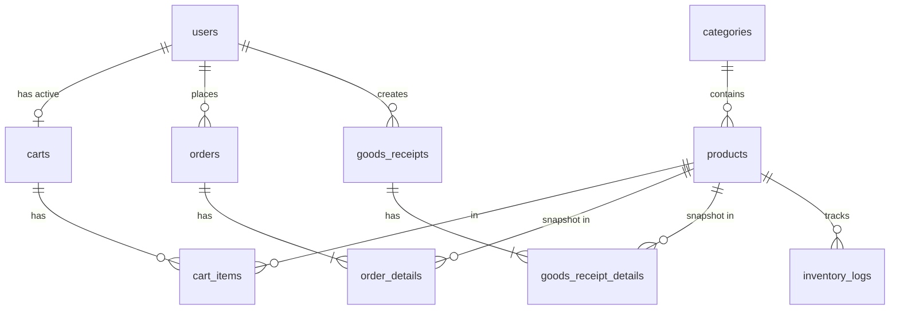
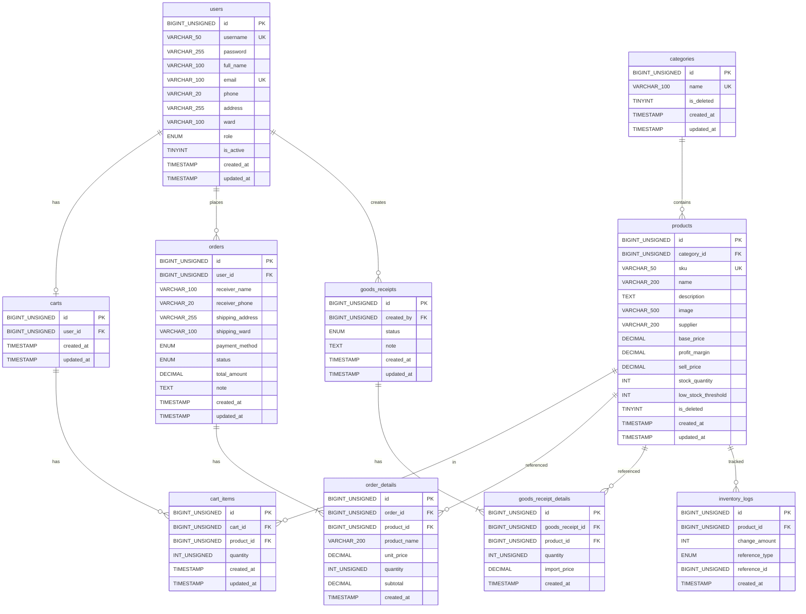

# Thiết Kế Cơ Sở Dữ Liệu (Database Design)

Tài liệu thiết kế toàn bộ CSDL cho hệ thống bán hàng trực tuyến, bao gồm ERD ý niệm (Conceptual), Schema vật lý (Physical), chứng minh nghiệp vụ, và DDL chạy được trên MySQL.

> **Tài liệu gốc tham chiếu:**
> - [`phan-tich-yeu-cau.md`](phan-tich-yeu-cau.md) — Yêu cầu chức năng & nghiệp vụ
> - [`db-assumptions.md`](db-assumptions.md) — Các giả định thiết kế CSDL
> - [`sql-naming-guide.md`](sql-naming-guide.md) — Quy ước đặt tên SQL

---

## Mục lục

1. [Conceptual ERD](#1-conceptual-erd)
2. [Relational Schema (Physical ERD)](#2-relational-schema-physical-erd)
3. [Chứng minh Schema hỗ trợ nghiệp vụ](#3-chứng-minh-schema-hỗ-trợ-nghiệp-vụ)
4. [SQL DDL](#4-sql-ddl)

---

## 1. Conceptual ERD

### 1.1 Danh sách Entity

| # | Entity | Mô tả |
|---|--------|--------|
| 1 | **User** | Tài khoản người dùng (cả khách hàng lẫn admin) |
| 2 | **Category** | Danh mục / loại sản phẩm |
| 3 | **Product** | Sản phẩm bán hàng |
| 4 | **Cart** | Giỏ hàng (1 user : 1 active cart) |
| 5 | **CartItem** | Chi tiết mặt hàng trong giỏ |
| 6 | **Order** | Đơn đặt hàng (snapshot địa chỉ, thanh toán) |
| 7 | **OrderDetail** | Chi tiết từng dòng sản phẩm trong đơn (snapshot giá) |
| 8 | **GoodsReceipt** | Phiếu nhập hàng |
| 9 | **GoodsReceiptDetail** | Chi tiết từng dòng sản phẩm nhập (snapshot giá nhập lô) |
| 10 | **InventoryLog** | Sổ cái ghi nhận mọi biến động tồn kho (±) |

### 1.2 Danh sách Relationship

```
User ──────────< Cart              (1:1 active)
User ──────────< Order             (1:N)
Category ──────< Product           (1:N)
Product ────────< CartItem         (1:N)
Cart ──────────< CartItem          (1:N)
Product ────────< OrderDetail      (1:N)
Order ─────────< OrderDetail       (1:N)
Product ────────< GoodsReceiptDetail (1:N)
GoodsReceipt ──< GoodsReceiptDetail  (1:N)
Product ────────< InventoryLog     (1:N)
User ──────────< GoodsReceipt      (1:N, created_by)
```

### 1.3 Conceptual ERD Diagram



---

## 2. Relational Schema (Physical ERD)

> **Quy ước chung (theo `sql-naming-guide.md`):**
> - Tên bảng: **plural, lowercase, snake_case**
> - PK: `id` (AUTO_INCREMENT)
> - FK: `<referenced_table_singular>_id`
> - Boolean: `is_*` / `has_*`
> - Timestamp: `created_at`, `updated_at`
> - Engine: InnoDB (hỗ trợ FK & Transaction)
> - Charset: `utf8mb4`, Collation: `utf8mb4_unicode_ci`

---

### 2.1 `users` — Tài khoản người dùng

Lưu thông tin đăng nhập, liên lạc, và địa chỉ mặc định của cả khách hàng (customer) lẫn quản trị (admin).

| Cột | Kiểu | Ràng buộc | Nullable | Mô tả |
|-----|------|-----------|----------|-------|
| `id` | BIGINT UNSIGNED | PK, AUTO_INCREMENT | NOT NULL | |
| `username` | VARCHAR(50) | UNIQUE | NOT NULL | Tên đăng nhập |
| `password` | VARCHAR(255) | | NOT NULL | Mật khẩu (bcrypt hash) |
| `full_name` | VARCHAR(100) | | NOT NULL | Họ tên |
| `email` | VARCHAR(100) | UNIQUE | NOT NULL | Email |
| `phone` | VARCHAR(20) | | NOT NULL | Số điện thoại |
| `address` | VARCHAR(255) | | NOT NULL | Địa chỉ mặc định (số nhà, đường) |
| `ward` | VARCHAR(100) | | NOT NULL | Phường / Xã mặc định |
| `role` | ENUM('customer','admin') | DEFAULT 'customer' | NOT NULL | Phân quyền |
| `is_active` | TINYINT(1) | DEFAULT 1 | NOT NULL | 1 = hoạt động, 0 = bị khóa |
| `created_at` | TIMESTAMP | DEFAULT CURRENT_TIMESTAMP | NOT NULL | |
| `updated_at` | TIMESTAMP | DEFAULT CURRENT_TIMESTAMP ON UPDATE | NOT NULL | |

**Indexes:** `uq_users_username(username)`, `uq_users_email(email)`, `ix_users_role(role)`

---

### 2.2 `categories` — Danh mục sản phẩm

Phân loại sản phẩm. Hỗ trợ soft delete khi còn sản phẩm tham chiếu.

| Cột | Kiểu | Ràng buộc | Nullable | Mô tả |
|-----|------|-----------|----------|-------|
| `id` | BIGINT UNSIGNED | PK, AUTO_INCREMENT | NOT NULL | |
| `name` | VARCHAR(100) | UNIQUE | NOT NULL | Tên danh mục |
| `is_deleted` | TINYINT(1) | DEFAULT 0 | NOT NULL | Soft delete flag |
| `created_at` | TIMESTAMP | DEFAULT CURRENT_TIMESTAMP | NOT NULL | |
| `updated_at` | TIMESTAMP | DEFAULT CURRENT_TIMESTAMP ON UPDATE | NOT NULL | |

---

### 2.3 `products` — Sản phẩm

Thực thể trung tâm của hệ thống. Lưu thông tin mô tả, giá hiện tại (operational), tồn kho hiện tại (cache), và trạng thái hiển thị.

| Cột | Kiểu | Ràng buộc | Nullable | Mô tả |
|-----|------|-----------|----------|-------|
| `id` | BIGINT UNSIGNED | PK, AUTO_INCREMENT | NOT NULL | |
| `category_id` | BIGINT UNSIGNED | FK → categories(id) | NOT NULL | Loại sản phẩm |
| `sku` | VARCHAR(50) | UNIQUE | NOT NULL | Mã sản phẩm (do admin nhập) |
| `name` | VARCHAR(200) | | NOT NULL | Tên sản phẩm |
| `description` | TEXT | | YES | Mô tả chi tiết |
| `image` | VARCHAR(500) | | YES | Đường dẫn ảnh sản phẩm |
| `supplier` | VARCHAR(200) | | YES | Nhà cung cấp (mang tính hình thức) |
| `base_price` | DECIMAL(15,2) | DEFAULT 0.00 | NOT NULL | Giá nhập bình quân gia quyền hiện tại |
| `profit_margin` | DECIMAL(5,2) | DEFAULT 0.00 | NOT NULL | % Tỷ lệ lợi nhuận (VD: 20.00 = 20%) |
| `sell_price` | DECIMAL(15,2) | DEFAULT 0.00 | NOT NULL | Giá bán = base_price × (1 + profit_margin/100) |
| `stock_quantity` | INT | DEFAULT 0 | NOT NULL | Tồn kho hiện tại (cache, realtime) |
| `low_stock_threshold` | INT | DEFAULT 10 | NOT NULL | Ngưỡng cảnh báo sắp hết hàng |
| `is_deleted` | TINYINT(1) | DEFAULT 0 | NOT NULL | Soft delete flag |
| `created_at` | TIMESTAMP | DEFAULT CURRENT_TIMESTAMP | NOT NULL | |
| `updated_at` | TIMESTAMP | DEFAULT CURRENT_TIMESTAMP ON UPDATE | NOT NULL | |

**Indexes:** `uq_products_sku(sku)`, `ix_products_category_id(category_id)`, `ix_products_is_deleted(is_deleted)`, `ix_products_sell_price(sell_price)`

**Ghi chú:**
- `base_price`, `profit_margin`, `sell_price` chỉ phản ánh **trạng thái hiện tại**. Giá quá khứ được lưu tại `order_details` và `goods_receipt_details`.
- `stock_quantity` là **cache** cho hiệu năng. Dữ liệu gốc nằm ở `inventory_logs`.
- `low_stock_threshold` cho phép admin cấu hình ngưỡng cảnh báo riêng từng sản phẩm.

---

### 2.4 `carts` — Giỏ hàng

Mỗi user chỉ có tối đa 1 giỏ hàng active (ràng buộc UNIQUE trên `user_id`).

| Cột | Kiểu | Ràng buộc | Nullable | Mô tả |
|-----|------|-----------|----------|-------|
| `id` | BIGINT UNSIGNED | PK, AUTO_INCREMENT | NOT NULL | |
| `user_id` | BIGINT UNSIGNED | FK → users(id), UNIQUE | NOT NULL | Chủ giỏ hàng |
| `created_at` | TIMESTAMP | DEFAULT CURRENT_TIMESTAMP | NOT NULL | |
| `updated_at` | TIMESTAMP | DEFAULT CURRENT_TIMESTAMP ON UPDATE | NOT NULL | |

**Indexes:** `uq_carts_user_id(user_id)`

**Ghi chú:** Ràng buộc UNIQUE trên `user_id` đảm bảo 1 user : 1 cart. Khi đặt hàng, `cart_items` được dọn đi (xóa), bản ghi `carts` có thể giữ lại hoặc xóa tùy implement.

---

### 2.5 `cart_items` — Chi tiết giỏ hàng

Từng mặt hàng trong giỏ. **Không ảnh hưởng tồn kho** — chỉ trừ kho khi chuyển sang đơn hàng.

| Cột | Kiểu | Ràng buộc | Nullable | Mô tả |
|-----|------|-----------|----------|-------|
| `id` | BIGINT UNSIGNED | PK, AUTO_INCREMENT | NOT NULL | |
| `cart_id` | BIGINT UNSIGNED | FK → carts(id) | NOT NULL | Giỏ hàng chứa |
| `product_id` | BIGINT UNSIGNED | FK → products(id) | NOT NULL | Sản phẩm |
| `quantity` | INT UNSIGNED | | NOT NULL | Số lượng (≥ 1) |
| `created_at` | TIMESTAMP | DEFAULT CURRENT_TIMESTAMP | NOT NULL | |
| `updated_at` | TIMESTAMP | DEFAULT CURRENT_TIMESTAMP ON UPDATE | NOT NULL | |

**Indexes:** `uq_cart_items_cart_product(cart_id, product_id)` — mỗi sản phẩm chỉ xuất hiện 1 lần trong 1 giỏ, cộng dồn quantity.

---

### 2.6 `orders` — Đơn đặt hàng

Snapshot toàn bộ thông tin người nhận, phương thức thanh toán, trạng thái xử lý.

| Cột | Kiểu | Ràng buộc | Nullable | Mô tả |
|-----|------|-----------|----------|-------|
| `id` | BIGINT UNSIGNED | PK, AUTO_INCREMENT | NOT NULL | |
| `user_id` | BIGINT UNSIGNED | FK → users(id) | NOT NULL | Khách đặt hàng |
| `receiver_name` | VARCHAR(100) | | NOT NULL | Tên người nhận (snapshot) |
| `receiver_phone` | VARCHAR(20) | | NOT NULL | SĐT người nhận (snapshot) |
| `shipping_address` | VARCHAR(255) | | NOT NULL | Địa chỉ giao (snapshot) |
| `shipping_ward` | VARCHAR(100) | | NOT NULL | Phường/Xã giao (cột riêng để sort/filter) |
| `payment_method` | ENUM('cod','bank_transfer','online') | | NOT NULL | Phương thức thanh toán |
| `status` | ENUM('pending','confirmed','delivered','cancelled') | DEFAULT 'pending' | NOT NULL | Trạng thái đơn hàng |
| `total_amount` | DECIMAL(15,2) | | NOT NULL | Tổng tiền đơn hàng (sum snapshot giá) |
| `note` | TEXT | | YES | Ghi chú của khách |
| `created_at` | TIMESTAMP | DEFAULT CURRENT_TIMESTAMP | NOT NULL | Thời điểm đặt hàng |
| `updated_at` | TIMESTAMP | DEFAULT CURRENT_TIMESTAMP ON UPDATE | NOT NULL | |

**Indexes:** `ix_orders_user_id(user_id)`, `ix_orders_status(status)`, `ix_orders_created_at(created_at)`, `ix_orders_shipping_ward(shipping_ward)`

**Ghi chú:**
- Thông tin người nhận là **snapshot cố định** tại thời điểm đặt hàng, không liên kết ngược `users`.
- `shipping_ward` tách riêng để hỗ trợ `ORDER BY` / `GROUP BY` theo Phường/Xã.
- `total_amount` là giá trị tính sẵn (denormalized) để truy vấn nhanh.

---

### 2.7 `order_details` — Chi tiết đơn hàng

Snapshot giá bán tại thời điểm đặt hàng -> đơn hàng cũ không bị ảnh hưởng khi sản phẩm đổi giá.

| Cột | Kiểu | Ràng buộc | Nullable | Mô tả |
|-----|------|-----------|----------|-------|
| `id` | BIGINT UNSIGNED | PK, AUTO_INCREMENT | NOT NULL | |
| `order_id` | BIGINT UNSIGNED | FK → orders(id) | NOT NULL | Đơn hàng chứa |
| `product_id` | BIGINT UNSIGNED | FK → products(id) | NOT NULL | Sản phẩm (tham chiếu gốc) |
| `product_name` | VARCHAR(200) | | NOT NULL | Tên SP tại thời điểm đặt (snapshot) |
| `unit_price` | DECIMAL(15,2) | | NOT NULL | Giá bán 1 đơn vị tại thời điểm đặt (snapshot) |
| `quantity` | INT UNSIGNED | | NOT NULL | Số lượng đặt |
| `subtotal` | DECIMAL(15,2) | | NOT NULL | = unit_price × quantity |
| `created_at` | TIMESTAMP | DEFAULT CURRENT_TIMESTAMP | NOT NULL | |

**Indexes:** `ix_order_details_order_id(order_id)`, `ix_order_details_product_id(product_id)`

**Ghi chú:**
- `product_name` được snapshot vì tên sản phẩm có thể bị admin sửa sau này.
- `product_id` vẫn giữ FK để truy vết gốc sản phẩm, nhưng dữ liệu hiển thị trong hóa đơn dùng `product_name` và `unit_price` snapshot.

---

### 2.8 `goods_receipts` — Phiếu nhập hàng

Đại diện cho 1 lần nhập hàng. Có trạng thái draft/completed, chỉ được sửa khi chưa hoàn thành.

| Cột | Kiểu | Ràng buộc | Nullable | Mô tả |
|-----|------|-----------|----------|-------|
| `id` | BIGINT UNSIGNED | PK, AUTO_INCREMENT | NOT NULL | |
| `created_by` | BIGINT UNSIGNED | FK → users(id) | NOT NULL | Admin tạo phiếu |
| `status` | ENUM('draft','completed') | DEFAULT 'draft' | NOT NULL | Trạng thái phiếu |
| `note` | TEXT | | YES | Ghi chú phiếu nhập |
| `created_at` | TIMESTAMP | DEFAULT CURRENT_TIMESTAMP | NOT NULL | |
| `updated_at` | TIMESTAMP | DEFAULT CURRENT_TIMESTAMP ON UPDATE | NOT NULL | |

**Indexes:** `ix_goods_receipts_created_by(created_by)`, `ix_goods_receipts_status(status)`, `ix_goods_receipts_created_at(created_at)`

**Ghi chú:**
- Khi `status = 'draft'`, admin vẫn được sửa thêm/bớt dòng sản phẩm.
- Khi ấn **"Hoàn thành"** (`status = 'completed'`), hệ thống mới thực sự cập nhật `stock_quantity`, `base_price`, `sell_price` trong `products` và ghi `inventory_logs`. Sau đó phiếu nhập bị khóa, không sửa được nữa.

---

### 2.9 `goods_receipt_details` — Chi tiết phiếu nhập

Từng dòng sản phẩm nhập trong 1 phiếu. Snapshot giá nhập lô.

| Cột | Kiểu | Ràng buộc | Nullable | Mô tả |
|-----|------|-----------|----------|-------|
| `id` | BIGINT UNSIGNED | PK, AUTO_INCREMENT | NOT NULL | |
| `goods_receipt_id` | BIGINT UNSIGNED | FK → goods_receipts(id) | NOT NULL | Phiếu nhập chứa |
| `product_id` | BIGINT UNSIGNED | FK → products(id) | NOT NULL | Sản phẩm nhập |
| `quantity` | INT UNSIGNED | | NOT NULL | Số lượng nhập |
| `import_price` | DECIMAL(15,2) | | NOT NULL | Giá nhập lô này (snapshot) |
| `created_at` | TIMESTAMP | DEFAULT CURRENT_TIMESTAMP | NOT NULL | |

**Indexes:** `ix_goods_receipt_details_receipt_id(goods_receipt_id)`, `ix_goods_receipt_details_product_id(product_id)`

---

### 2.10 `inventory_logs` — Sổ cái tồn kho (Inventory Ledger)

Ghi nhận **mọi** biến động tồn kho (±). Đây là nguồn dữ liệu gốc (source of truth) cho lịch sử tồn kho và báo cáo nhập/xuất.

| Cột | Kiểu | Ràng buộc | Nullable | Mô tả |
|-----|------|-----------|----------|-------|
| `id` | BIGINT UNSIGNED | PK, AUTO_INCREMENT | NOT NULL | |
| `product_id` | BIGINT UNSIGNED | FK → products(id) | NOT NULL | Sản phẩm bị biến động |
| `change_amount` | INT | | NOT NULL | Số lượng thay đổi (+nhập/init, −xuất) |
| `reference_type` | ENUM('product_init','goods_receipt','order_placed','order_cancelled') | | NOT NULL | Loại nghiệp vụ gây biến động |
| `reference_id` | BIGINT UNSIGNED | | NOT NULL | ID bản ghi gốc (product/goods_receipt/order) |
| `created_at` | TIMESTAMP | DEFAULT CURRENT_TIMESTAMP | NOT NULL | Thời điểm biến động |

**Indexes:** `ix_inventory_logs_product_id(product_id)`, `ix_inventory_logs_reference(reference_type, reference_id)`, `ix_inventory_logs_created_at(created_at)`

**Ghi chú về `reference_type`:**

| Giá trị | Trigger | `change_amount` | `reference_id` trỏ tới |
|---------|---------|-----------------|------------------------|
| `product_init` | Tạo SP mới | + (SL khởi tạo) | `products.id` |
| `goods_receipt` | Hoàn thành phiếu nhập | + (SL nhập) | `goods_receipts.id` |
| `order_placed` | Khách đặt đơn (Pending) | − (SL đặt) | `orders.id` |
| `order_cancelled` | Hủy đơn hàng | + (SL hoàn) | `orders.id` |

---

### 2.11 Physical ERD Diagram



---

## 3. Chứng Minh Schema Hỗ Trợ Nghiệp Vụ

### 3.1 Snapshot giá bán / giá nhập — Lịch sử đơn hàng bất biến

**Yêu cầu:** Khi sản phẩm đổi giá, các đơn hàng đã đặt trước đó không bị ảnh hưởng.

**Cách schema xử lý:**

- `order_details.unit_price` lưu **giá bán tại thời điểm đặt hàng** (snapshot), hoàn toàn độc lập với `products.sell_price`.
- `order_details.product_name` cũng được snapshot để tránh bị ảnh hưởng khi admin đổi tên sản phẩm.
- `goods_receipt_details.import_price` lưu **giá nhập của lô hàng đó** (snapshot), độc lập với `products.base_price`.

```sql
-- Truy vấn hoá đơn đơn hàng #42: dùng dữ liệu snapshot, không JOIN ngược products
SELECT od.product_name, od.unit_price, od.quantity, od.subtotal
FROM order_details od
WHERE od.order_id = 42;
```

> Dù admin thay đổi `products.sell_price` hay `products.name` bao nhiêu lần, kết quả truy vấn trên **không bao giờ thay đổi**.

---

### 3.2 Tồn kho hiện tại & Tồn kho tại thời điểm quá khứ

**Yêu cầu:** Tra cứu tồn kho realtime và tồn kho tại 1 thời điểm bất kỳ trong quá khứ.

**Tồn kho hiện tại (nhanh — O(1)):**

```sql
-- Đọc trực tiếp từ cache
SELECT name, stock_quantity FROM products WHERE id = 5;
```

**Tồn kho tại thời điểm T (truy vấn ledger):**

```sql
-- Tồn kho sản phẩm #5 tại ngày 2026-01-15 23:59:59
SELECT SUM(change_amount) AS stock_at_time
FROM inventory_logs
WHERE product_id = 5 AND created_at <= '2026-01-15 23:59:59';
```

Nhờ quy ước **Init Log** (mỗi sản phẩm khi tạo đều có dòng `product_init`), `SUM(change_amount)` luôn ra con số tồn kho chính xác mà không cần bất kỳ tham số bổ sung nào.

---

### 3.3 Báo cáo Nhập / Xuất theo thời gian

**Yêu cầu:** Báo cáo số lượng nhập - xuất trong khoảng thời gian.

```sql
-- Báo cáo nhập/xuất sản phẩm #5 từ 01/01 đến 31/01/2026
SELECT
    reference_type,
    SUM(ABS(change_amount)) AS total_quantity
FROM inventory_logs
WHERE product_id = 5
  AND created_at BETWEEN '2026-01-01' AND '2026-01-31 23:59:59'
  AND reference_type IN ('goods_receipt', 'order_placed')
GROUP BY reference_type;
```

**Báo cáo tổng hợp toàn bộ sản phẩm:**

```sql
-- Tổng nhập, tổng xuất, và tồn kho cuối kỳ cho tất cả sản phẩm
SELECT
    p.id,
    p.name,
    COALESCE(SUM(CASE WHEN il.reference_type = 'goods_receipt' THEN il.change_amount END), 0) AS total_imported,
    COALESCE(SUM(CASE WHEN il.reference_type = 'order_placed' THEN ABS(il.change_amount) END), 0) AS total_sold,
    p.stock_quantity AS current_stock
FROM products p
LEFT JOIN inventory_logs il ON p.id = il.product_id
    AND il.created_at BETWEEN '2026-01-01' AND '2026-01-31 23:59:59'
WHERE p.is_deleted = 0
GROUP BY p.id, p.name, p.stock_quantity;
```

---

### 3.4 Soft Delete / Hard Delete theo đúng rule

**Yêu cầu:**
- Sản phẩm: Hard delete nếu chưa phát sinh giao dịch, soft delete nếu đã có.
- Danh mục: Hard delete nếu không còn sản phẩm tham chiếu, soft delete nếu còn.

**Kiểm tra sản phẩm đã phát sinh giao dịch chưa:**

```sql
-- Nếu COUNT > 0 thì SOFT DELETE, ngược lại HARD DELETE
SELECT COUNT(*) AS has_transactions
FROM inventory_logs
WHERE product_id = :id AND reference_type != 'product_init';
```

**Kiểm tra danh mục có sản phẩm tham chiếu không:**

```sql
-- Nếu COUNT > 0 thì SOFT DELETE, ngược lại HARD DELETE
SELECT COUNT(*) AS active_products
FROM products
WHERE category_id = :id AND is_deleted = 0;
```

**Hiển thị sản phẩm cho khách hàng (Front-end):**

```sql
-- Sản phẩm chỉ hiện khi CẢ product VÀ category đều chưa bị xóa mềm
SELECT p.*
FROM products p
INNER JOIN categories c ON p.category_id = c.id
WHERE p.is_deleted = 0 AND c.is_deleted = 0;
```

> **Liên đới ẩn/hiện:** Khi Category bị soft delete, Product bên trong vẫn giữ nguyên `is_deleted = 0`, nhưng tự động ẩn khỏi UI nhờ điều kiện JOIN. Khi restore Category, Product hiện lại mà không cần thao tác gì thêm.

---

### 3.5 Quản lý giỏ hàng

**Yêu cầu:** 1 user : 1 active cart; giỏ hàng không ảnh hưởng tồn kho; dọn giỏ khi đặt hàng.

**Ràng buộc 1:1 bằng UNIQUE KEY:**

```sql
-- UNIQUE(user_id) trên bảng carts → mỗi user tối đa 1 giỏ
```

**Thêm/cập nhật sản phẩm vào giỏ (UPSERT):**

```sql
-- UNIQUE(cart_id, product_id) → nếu SP đã có trong giỏ thì cộng dồn quantity
INSERT INTO cart_items (cart_id, product_id, quantity)
VALUES (:cart_id, :product_id, :qty)
ON DUPLICATE KEY UPDATE quantity = quantity + :qty;
```

**Giỏ hàng không trừ kho:**

Bảng `cart_items` không trigger bất kỳ thay đổi nào lên `products.stock_quantity` hay `inventory_logs`. Tồn kho chỉ bị trừ khi dữ liệu được chuyển sang `order_details` (khi đặt hàng).

---

### 3.6 Giá nhập bình quân gia quyền & Giá bán

**Yêu cầu:** Mỗi khi nhập lô mới, cập nhật giá nhập bình quân gia quyền → tính giá bán.

**Công thức (khi nhập lô mới):**

```
new_base_price = (stock_quantity × base_price + import_qty × import_price) / (stock_quantity + import_qty)
new_sell_price = new_base_price × (1 + profit_margin / 100)
```

**Thực thi trong Transaction (pseudocode Laravel):**

```php
DB::transaction(function () use ($product, $importQty, $importPrice) {
    // 1. Tính giá nhập bình quân mới
    $newBase = ($product->stock_quantity * $product->base_price + $importQty * $importPrice)
               / ($product->stock_quantity + $importQty);
    $newSell = $newBase * (1 + $product->profit_margin / 100);

    // 2. Cập nhật products (cache)
    $product->update([
        'base_price'      => round($newBase, 2),
        'sell_price'      => round($newSell, 2),
        'stock_quantity'  => $product->stock_quantity + $importQty,
    ]);

    // 3. Ghi inventory_logs (ledger)
    InventoryLog::create([
        'product_id'     => $product->id,
        'change_amount'  => $importQty,
        'reference_type' => 'goods_receipt',
        'reference_id'   => $goodsReceipt->id,
    ]);
});
```

---

### 3.7 Cảnh báo tồn kho thấp

**Yêu cầu:** Admin cấu hình ngưỡng, hệ thống cảnh báo khi tồn kho thấp.

```sql
-- Danh sách sản phẩm sắp hết hàng
SELECT id, name, stock_quantity, low_stock_threshold
FROM products
WHERE stock_quantity <= low_stock_threshold
  AND is_deleted = 0;
```

Cột `low_stock_threshold` trên từng sản phẩm cho phép admin đặt ngưỡng riêng biệt.

---

### 3.8 Lọc & sắp xếp đơn hàng theo Phường/Xã

**Yêu cầu:** Sắp xếp danh sách đơn hàng theo địa chỉ (Phường/Xã).

```sql
-- Sắp xếp đơn hàng theo Phường/Xã nhờ cột riêng biệt
SELECT * FROM orders
WHERE status = 'pending'
ORDER BY shipping_ward ASC, created_at DESC;
```

Cột `shipping_ward` tách riêng (không nhúng trong chuỗi address) → `ORDER BY` / `GROUP BY` hoạt động chính xác.

---

### 3.9 Luồng trạng thái đơn hàng (State Machine)

**Yêu cầu:** Flow 1 chiều, không quay lui.

| Từ trạng thái | Có thể chuyển sang |
|----------------|-------------------|
| `pending` | `confirmed`, `cancelled` |
| `confirmed` | `delivered`, `cancelled` |
| `delivered` | *(không chuyển được)* |
| `cancelled` | *(không chuyển được)* |

Logic này được enforce ở **tầng Application** (Laravel Controller/Service), không cần DB trigger phức tạp. Schema hỗ trợ bằng kiểu `ENUM` giới hạn giá trị hợp lệ.

---

### 3.10 Quản lý tài khoản Admin

**Yêu cầu:** Thêm, khởi tạo mật khẩu, khóa tài khoản. KHÔNG sửa thông tin cá nhân, KHÔNG xóa.

- `users.role = 'admin'` phân biệt admin vs customer.
- `users.is_active` = 0 → tài khoản bị khóa, không cho đăng nhập.
- Không có chức năng `DELETE` trên bảng `users` → dữ liệu tài khoản luôn được bảo toàn.

---

## 4. SQL DDL

Script sau chạy được trực tiếp trên MySQL 8.0+: [db-design.sql](db-design.sql)

---

## Phụ lục: Tóm tắt bảng & số lượng cột

| # | Bảng | Số cột | Vai trò chính |
|---|------|--------|---------------|
| 1 | `users` | 12 | Tài khoản (customer + admin) |
| 2 | `categories` | 5 | Phân loại sản phẩm |
| 3 | `products` | 15 | Sản phẩm, giá hiện tại, tồn kho cache |
| 4 | `carts` | 4 | Giỏ hàng (1:1 với user) |
| 5 | `cart_items` | 6 | Mặt hàng trong giỏ |
| 6 | `orders` | 12 | Đơn hàng (snapshot người nhận) |
| 7 | `order_details` | 8 | Dòng sản phẩm trong đơn (snapshot giá) |
| 8 | `goods_receipts` | 6 | Phiếu nhập hàng |
| 9 | `goods_receipt_details` | 6 | Dòng sản phẩm nhập (snapshot giá nhập) |
| 10 | `inventory_logs` | 6 | Sổ cái biến động tồn kho |
| | **Tổng** | **10 bảng** | |
